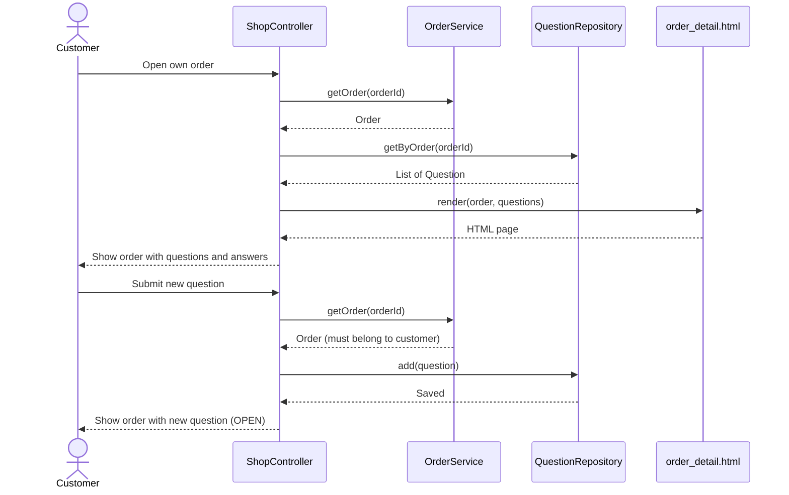

```mermaid
sequenceDiagram
    actor Customer
    participant ShopController
    participant OrderService
    participant QuestionRepository
    participant OrderTemplate as order_detail.html

    Customer->>ShopController: Open own order
    ShopController->>OrderService: getOrder(orderId)
    OrderService-->>ShopController: Order
    ShopController->>QuestionRepository: getByOrder(orderId)
    QuestionRepository-->>ShopController: List of Question
    ShopController->>OrderTemplate: render(order, questions)
    OrderTemplate-->>ShopController: HTML page
    ShopController-->>Customer: Show order with questions and answers

    Customer->>ShopController: Submit new question
    ShopController->>OrderService: getOrder(orderId)
    OrderService-->>ShopController: Order (must belong to customer)
    ShopController->>QuestionRepository: add(question)
    QuestionRepository-->>ShopController: Saved
    ShopController-->>Customer: Show order with new question (OPEN)
```