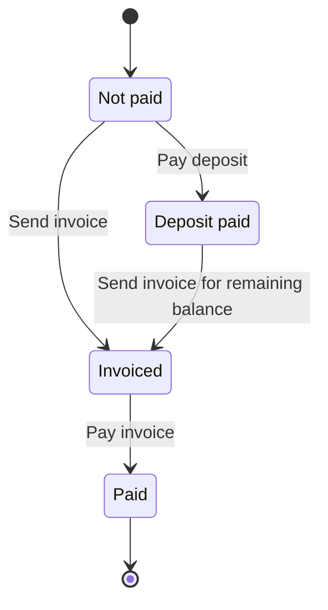

# A3 Payment - state machine

```mermaid
stateDiagram-v2
    state "Not paid" as NotPaid
    state "Deposit paid" as DepositPaid

    [*] --> NotPaid
    NotPaid --> DepositPaid: Pay deposit
    NotPaid --> Invoiced: Send invoice
    DepositPaid --> Invoiced: Send invoice for remaining balance
    Invoiced --> Paid: Pay invoice
    Paid --> [*]
```
