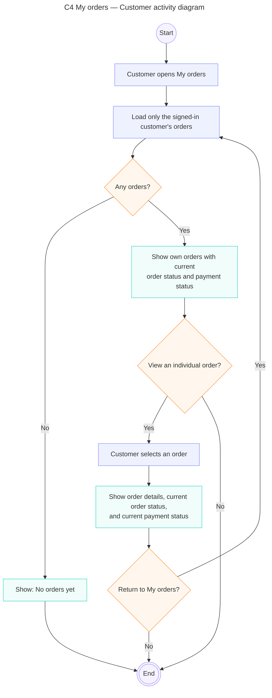

# C4 My orders – activity diagram

```mermaid
---
title: C4 My orders — Customer activity diagram
---
flowchart TD
Start((Start)) --> Open["Customer opens My orders"]
Open --> Load["Load only the signed-in customer's orders"]
Load --> HasOrders{"Any orders?"}
HasOrders -->|No| Empty["Show: No orders yet"]
HasOrders -->|Yes| List["Show own orders with current<br/>order status and payment status"]
List --> Select{"View an individual order?"}
Select -->|Yes| Details["Customer selects an order"]
Details --> Show["Show order details, current order status,<br/>and current payment status"]
Show --> Back{"Return to My orders?"}
Back -->|Yes| Load
Back -->|No| Finish(((End)))
Select -->|No| Finish
Empty --> Finish

classDef action fill:#eef2ff,stroke:#818cf8
classDef decision fill:#fff7ed,stroke:#fb923c
classDef display fill:#f0fdfa,stroke:#2dd4bf
classDef terminal fill:#f5f3ff,stroke:#a78bfa
class Open,Load,Details action
class HasOrders,Select,Back decision
class Empty,List,Show display
class Start,Finish terminal
``` 
