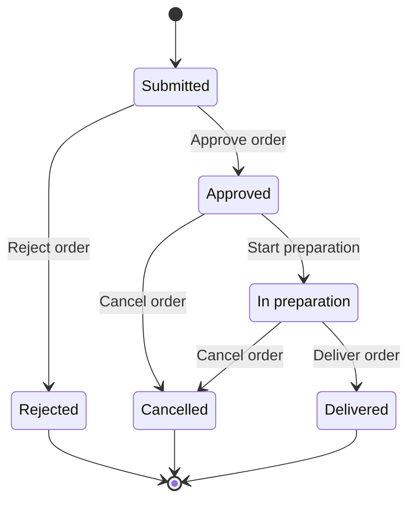

# A3 Order status – state machine

The allowed changes of an order's status. Payment status is tracked separately in `a3-payment-status-state.md`.

```mermaid
stateDiagram-v2
    %% Delivery / order status
    state "In preparation" as InPreparation

    [*] --> Submitted
    Submitted --> Approved: Approve order
    Submitted --> Rejected: Reject order
    Approved --> InPreparation: Start preparation
    Approved --> Cancelled: Cancel order
    InPreparation --> Delivered: Deliver order
    InPreparation --> Cancelled: Cancel order

    Rejected --> [*]
    Cancelled --> [*]
    Delivered --> [*]
```
