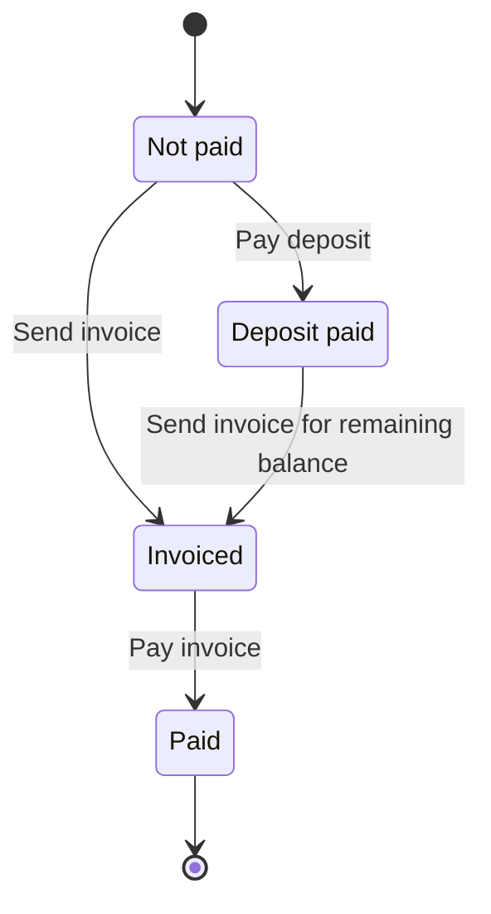

# A3 Payment status – state machine

The allowed changes of an order's payment status. It is separate from the order status in `a3-order-status-state.md`.

```mermaid
stateDiagram-v2
    state "Not paid" as NotPaid
    state "Deposit paid" as DepositPaid

    [*] --> NotPaid
    NotPaid --> DepositPaid: Pay deposit
    NotPaid --> Invoiced: Send invoice
    DepositPaid --> Invoiced: Send invoice for remaining balance
    Invoiced --> Paid: Pay invoice
    Paid --> [*]
```
