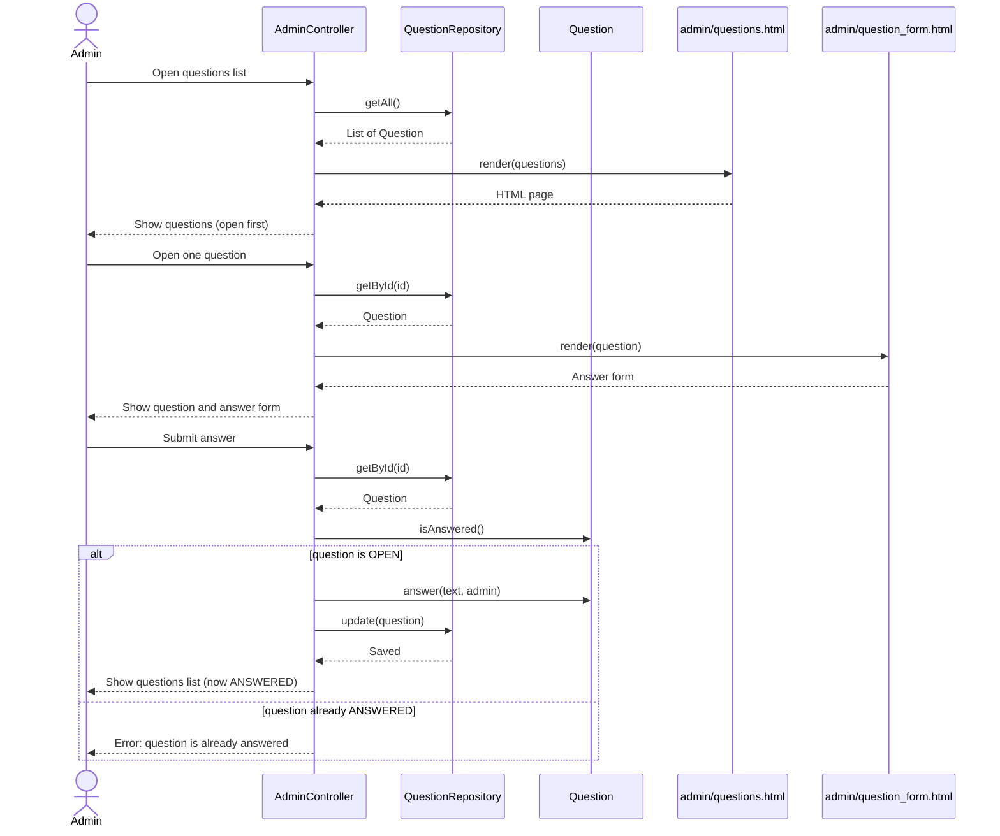

# A4 Answer customer questions – sequence diagram

How an admin sees the customers' questions and answers one. A question can only be answered once (see `c5-question-status-state.md`).

```mermaid
sequenceDiagram
    actor Admin
    participant AdminController
    participant QuestionRepository
    participant Question
    participant ListTemplate as admin/questions.html
    participant FormTemplate as admin/question_form.html

    Admin->>AdminController: Open questions list
    AdminController->>QuestionRepository: getAll()
    QuestionRepository-->>AdminController: List of Question
    AdminController->>ListTemplate: render(questions)
    ListTemplate-->>AdminController: HTML page
    AdminController-->>Admin: Show questions (open first)

    Admin->>AdminController: Open one question
    AdminController->>QuestionRepository: getById(id)
    QuestionRepository-->>AdminController: Question
    AdminController->>FormTemplate: render(question)
    FormTemplate-->>AdminController: Answer form
    AdminController-->>Admin: Show question and answer form

    Admin->>AdminController: Submit answer
    AdminController->>QuestionRepository: getById(id)
    QuestionRepository-->>AdminController: Question
    AdminController->>Question: isAnswered()
    alt question is OPEN
        AdminController->>Question: answer(text, admin)
        AdminController->>QuestionRepository: update(question)
        QuestionRepository-->>AdminController: Saved
        AdminController-->>Admin: Show questions list (now ANSWERED)
    else question already ANSWERED
        AdminController-->>Admin: Error: question is already answered
    end
```
