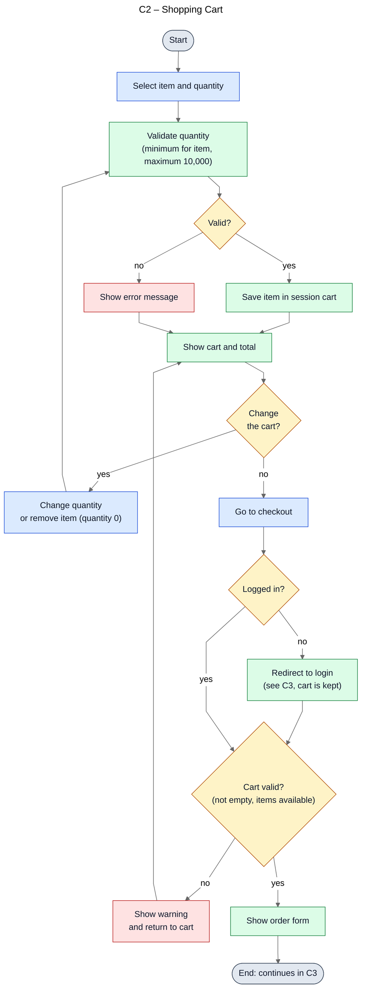

# C2 Shopping cart – activity diagram

How the customer builds the cart, with minimum order quantities checked for each item, until they go to checkout.

```mermaid
---
title: "C2 – Shopping Cart"
config:
  theme: neutral
  flowchart:
    curve: linear
    nodeSpacing: 40
    rankSpacing: 40
---
flowchart TD
    Start([Start]) --> A["Select item and quantity"]
    A --> B["Validate quantity<br/>(minimum for item, maximum 10,000)"]
    B --> C{"Valid?"}
    C -->|no| E1["Show error message"]
    C -->|yes| D["Save item in session cart"]
    D --> F["Show cart and total"]
    E1 --> F

    F --> G{"Change<br/>the cart?"}
    G -->|yes| H["Change quantity<br/>or remove item (quantity 0)"]
    H --> B
    G -->|no| I["Go to checkout"]

    I --> J{"Logged in?"}
    J -->|no| K["Redirect to login<br/>(see C3, cart is kept)"]
    K --> L
    J -->|yes| L{"Cart valid?<br/>(not empty, items available)"}
    L -->|no| M["Show warning<br/>and return to cart"]
    M --> F
    L -->|yes| N["Show order form"]
    N --> End([End: continues in C3])

    classDef customer fill:#DBEAFE,stroke:#1D4ED8,color:#0F172A
    classDef system fill:#DCFCE7,stroke:#15803D,color:#0F172A
    classDef decision fill:#FEF3C7,stroke:#B45309,color:#0F172A
    classDef error fill:#FEE2E2,stroke:#B91C1C,color:#0F172A
    classDef terminal fill:#E2E8F0,stroke:#334155,color:#0F172A

    class A,H,I customer
    class B,D,F,K,N system
    class C,G,J,L decision
    class E1,M error
    class Start,End terminal
```
