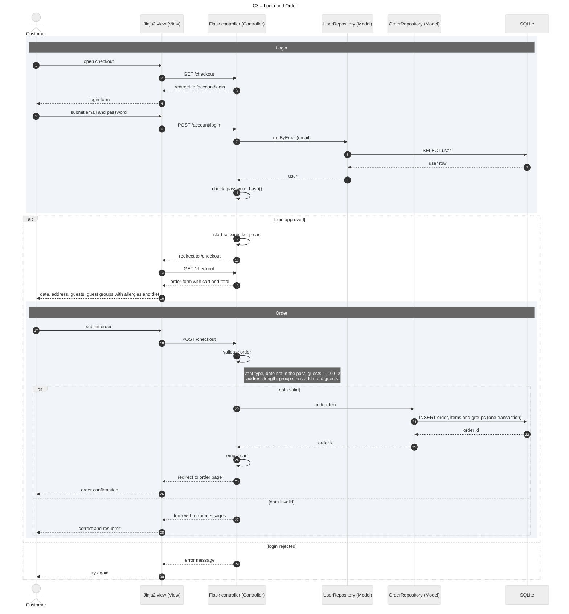

```mermaid
---
title: "C3 – Login and Order"
config:
  theme: neutral
---
sequenceDiagram
    autonumber
    actor Customer
    participant View as Jinja2 view (View)
    participant Controller as Flask controller (Controller)
    participant Users as UserRepository (Model)
    participant Orders as OrderRepository (Model)
    participant DB as SQLite

    rect rgb(241, 245, 249)
    Note over Customer,DB: Login
    Customer->>View: open checkout
    View->>Controller: GET /checkout
    Controller-->>View: redirect to /account/login
    View-->>Customer: login form
    Customer->>View: submit email and password
    View->>Controller: POST /account/login
    Controller->>Users: getByEmail(email)
    Users->>DB: SELECT user
    DB-->>Users: user row
    Users-->>Controller: user
    Controller->>Controller: check_password_hash()
    end

    alt login approved
        Controller->>Controller: start session, keep cart
        Controller-->>View: redirect to /checkout
        View->>Controller: GET /checkout
        Controller-->>View: order form with cart and total
        View-->>Customer: date, address, guests, guest groups with allergies and diet

        rect rgb(241, 245, 249)
        Note over Customer,DB: Order
        Customer->>View: submit order
        View->>Controller: POST /checkout
        Controller->>Controller: validate order
        Note right of Controller: Event type, date not in the past, guests 1–10,000,<br/>address length, group sizes add up to guests

        alt data valid
            Controller->>Orders: add(order)
            Orders->>DB: INSERT order, items and groups (one transaction)
            DB-->>Orders: order id
            Orders-->>Controller: order id
            Controller->>Controller: empty cart
            Controller-->>View: redirect to order page
            View-->>Customer: order confirmation
        else data invalid
            Controller-->>View: form with error messages
            View-->>Customer: correct and resubmit
        end
        end
    else login rejected
        Controller-->>View: error message
        View-->>Customer: try again
    end
```
