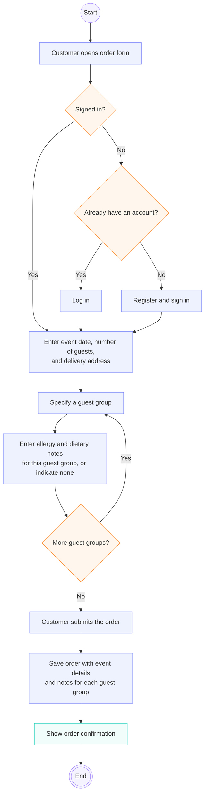

# C3 Order – activity diagram

```mermaid
flowchart TD
    Start((Start)) --> Open["Customer opens order form"]
    Open --> SignedIn{"Signed in?"}
    SignedIn -->|No| Account{"Already have an account?"}
    Account -->|Yes| Login["Log in"]
    Account -->|No| Register["Register and sign in"]
    SignedIn -->|Yes| Event["Enter event date, number of guests,<br/>and delivery address"]
    Login --> Event
    Register --> Event
    Event --> Group["Specify a guest group"]
    Group --> Allergies["Enter allergy and dietary notes<br/>for this guest group, or indicate none"]
    Allergies --> More{"More guest groups?"}
    More -->|Yes| Group
    More -->|No| Submit["Customer submits the order"]
    Submit --> Save["Save order with event details<br/>and notes for each guest group"]
    Save --> Confirm["Show order confirmation"]
    Confirm --> Finish((("End")))

    classDef action fill:#eef2ff,stroke:#818cf8
    classDef decision fill:#fff7ed,stroke:#fb923c
    classDef display fill:#f0fdfa,stroke:#2dd4bf
    classDef terminal fill:#f5f3ff,stroke:#a78bfa
    class Open,Login,Register,Event,Group,Allergies,Submit,Save action
    class SignedIn,Account,More decision
    class Confirm display
    class Start,Finish terminal
``` 
