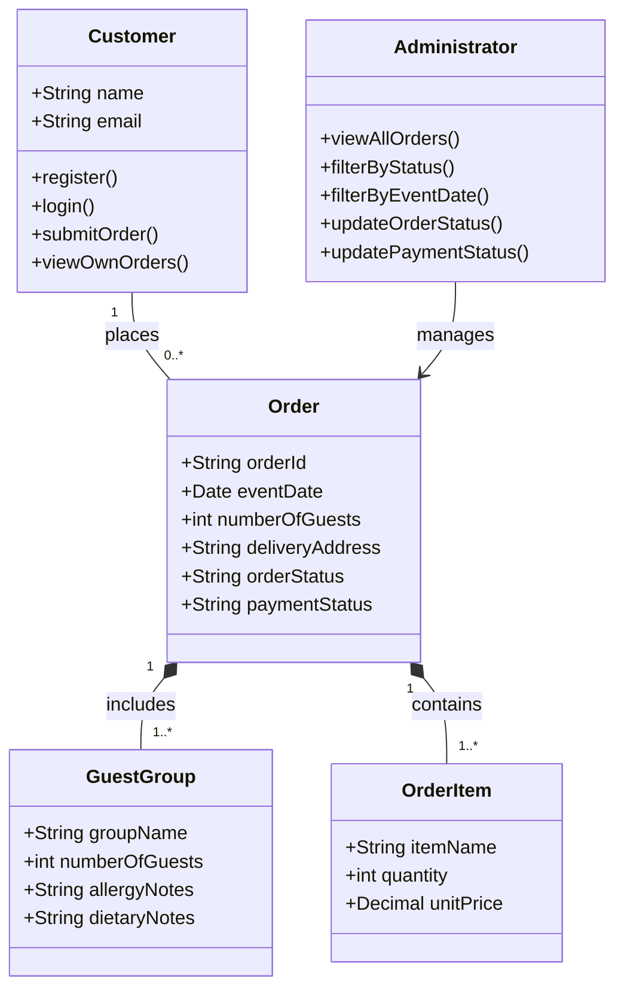

```mermaid
classDiagram
    direction TB

    class Customer {
        +String name
        +String email
        +register()
        +login()
        +submitOrder()
        +viewOwnOrders()
    }

    class Administrator {
        +viewAllOrders()
        +filterByStatus()
        +filterByEventDate()
        +updateOrderStatus()
        +updatePaymentStatus()
    }

    class Order {
        +String orderId
        +Date eventDate
        +int numberOfGuests
        +String deliveryAddress
        +String orderStatus
        +String paymentStatus
    }

    class GuestGroup {
        +String groupName
        +int numberOfGuests
        +String allergyNotes
        +String dietaryNotes
    }

    class OrderItem {
        +String itemName
        +int quantity
        +Decimal unitPrice
    }

    Customer "1" -- "0..*" Order : places
    Administrator --> Order : manages
    Order "1" *-- "1..*" GuestGroup : includes
    Order "1" *-- "1..*" OrderItem : contains
```
