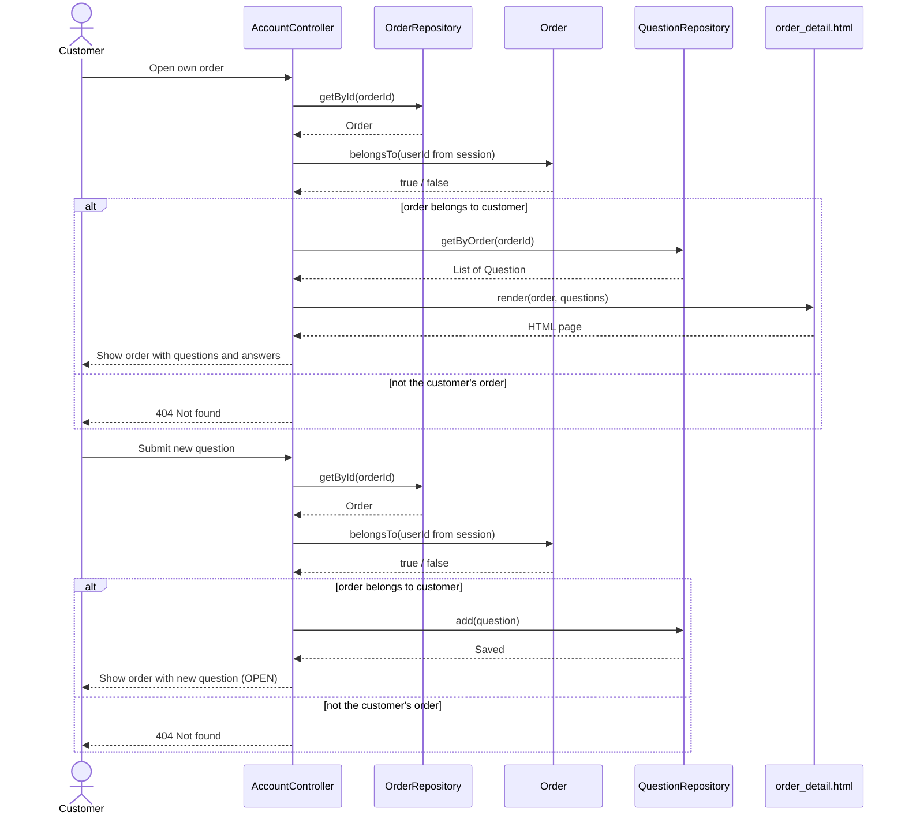

```mermaid
sequenceDiagram
    actor Customer
    participant AccountController
    participant OrderRepository
    participant Order
    participant QuestionRepository
    participant OrderTemplate as order_detail.html

    Customer->>AccountController: Open own order
    AccountController->>OrderRepository: getById(orderId)
    OrderRepository-->>AccountController: Order
    AccountController->>Order: belongsTo(userId from session)
    Order-->>AccountController: true / false
    alt order belongs to customer
        AccountController->>QuestionRepository: getByOrder(orderId)
        QuestionRepository-->>AccountController: List of Question
        AccountController->>OrderTemplate: render(order, questions)
        OrderTemplate-->>AccountController: HTML page
        AccountController-->>Customer: Show order with questions and answers
    else not the customer's order
        AccountController-->>Customer: 404 Not found
    end

    Customer->>AccountController: Submit new question
    AccountController->>OrderRepository: getById(orderId)
    OrderRepository-->>AccountController: Order
    AccountController->>Order: belongsTo(userId from session)
    Order-->>AccountController: true / false
    alt order belongs to customer
        AccountController->>QuestionRepository: add(question)
        QuestionRepository-->>AccountController: Saved
        AccountController-->>Customer: Show order with new question (OPEN)
    else not the customer's order
        AccountController-->>Customer: 404 Not found
    end
```
