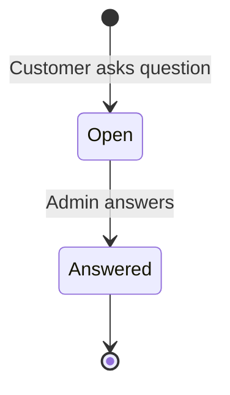

# C5 Question status – state machine

A question starts as OPEN and becomes ANSWERED when an admin answers it. It cannot be answered twice.

```mermaid
stateDiagram-v2
    [*] --> Open: Customer asks question
    Open --> Answered: Admin answers
    Answered --> [*]
```