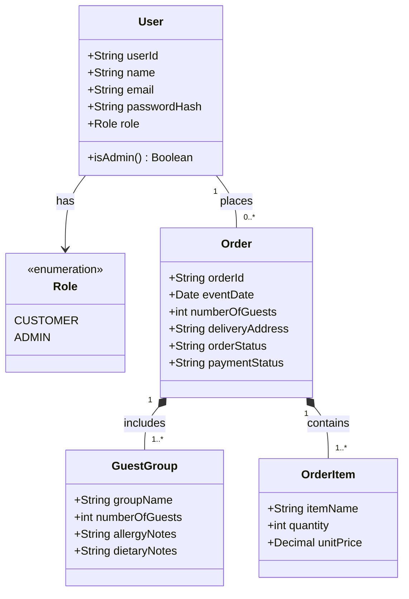

```mermaid
classDiagram
    direction TB

    class User {
        +String userId
        +String name
        +String email
        +String passwordHash
        +Role role
        +isAdmin() Boolean
    }

    class Role {
        <<enumeration>>
        CUSTOMER
        ADMIN
    }

    class Order {
        +String orderId
        +Date eventDate
        +int numberOfGuests
        +String deliveryAddress
        +String orderStatus
        +String paymentStatus
    }

    class GuestGroup {
        +String groupName
        +int numberOfGuests
        +String allergyNotes
        +String dietaryNotes
    }

    class OrderItem {
        +String itemName
        +int quantity
        +Decimal unitPrice
    }

    User --> Role : has
    User "1" -- "0..*" Order : places
    Order "1" *-- "1..*" GuestGroup : includes
    Order "1" *-- "1..*" OrderItem : contains

```
