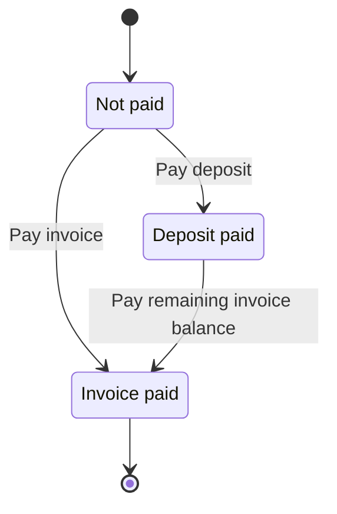

# A3 Payment - state machine

```mermaid
stateDiagram-v2
    state "Not paid" as NotPaid
    state "Deposit paid" as DepositPaid
    state "Invoice paid" as InvoicePaid

    [*] --> NotPaid
    NotPaid --> DepositPaid: Pay deposit
    NotPaid --> InvoicePaid: Pay invoice
    DepositPaid --> InvoicePaid: Pay remaining invoice balance
    InvoicePaid --> [*]
```
