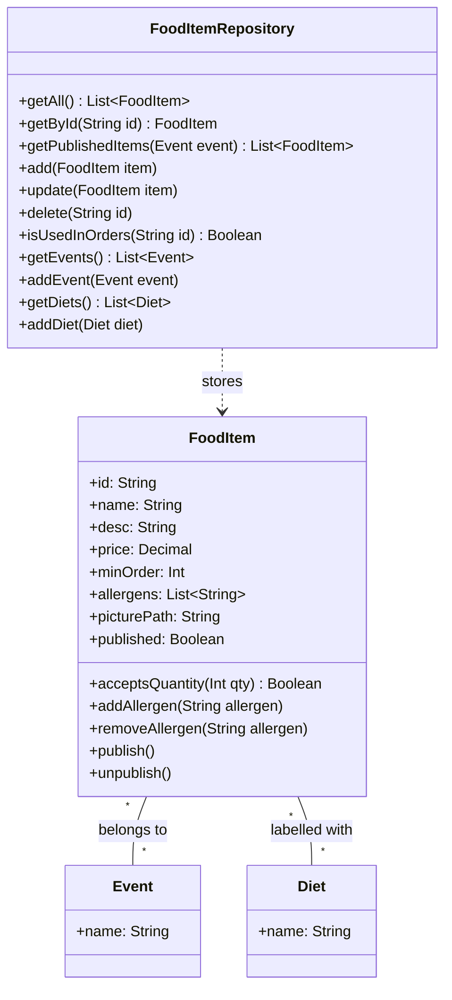

# Food items – class diagram

The domain classes for food items, events, diets and the `FoodItemRepository`.

```mermaid
   classDiagram
    class FoodItem {
        +id: String
        +name: String
        +desc: String
        +price: Decimal
        +minOrder: Int
        +allergens: List~String~
        +picturePath: String
        +published: Boolean
        +acceptsQuantity(Int qty) Boolean
        +addAllergen(String allergen)
        +removeAllergen(String allergen)
        +publish()
        +unpublish()
    }

    class Event {
        +name: String
    }

    class Diet {
        +name: String
    }

    class FoodItemRepository {
        +getAll() List~FoodItem~
        +getById(String id) FoodItem
        +getPublishedItems(Event event) List~FoodItem~
        +add(FoodItem item)
        +update(FoodItem item)
        +delete(String id)
        +isUsedInOrders(String id) Boolean
        +getEvents() List~Event~
        +addEvent(Event event)
        +getDiets() List~Diet~
        +addDiet(Diet diet)
    }

    FoodItem "*" -- "*" Event : belongs to
    FoodItem "*" -- "*" Diet : labelled with
    FoodItemRepository ..> FoodItem : stores

```
