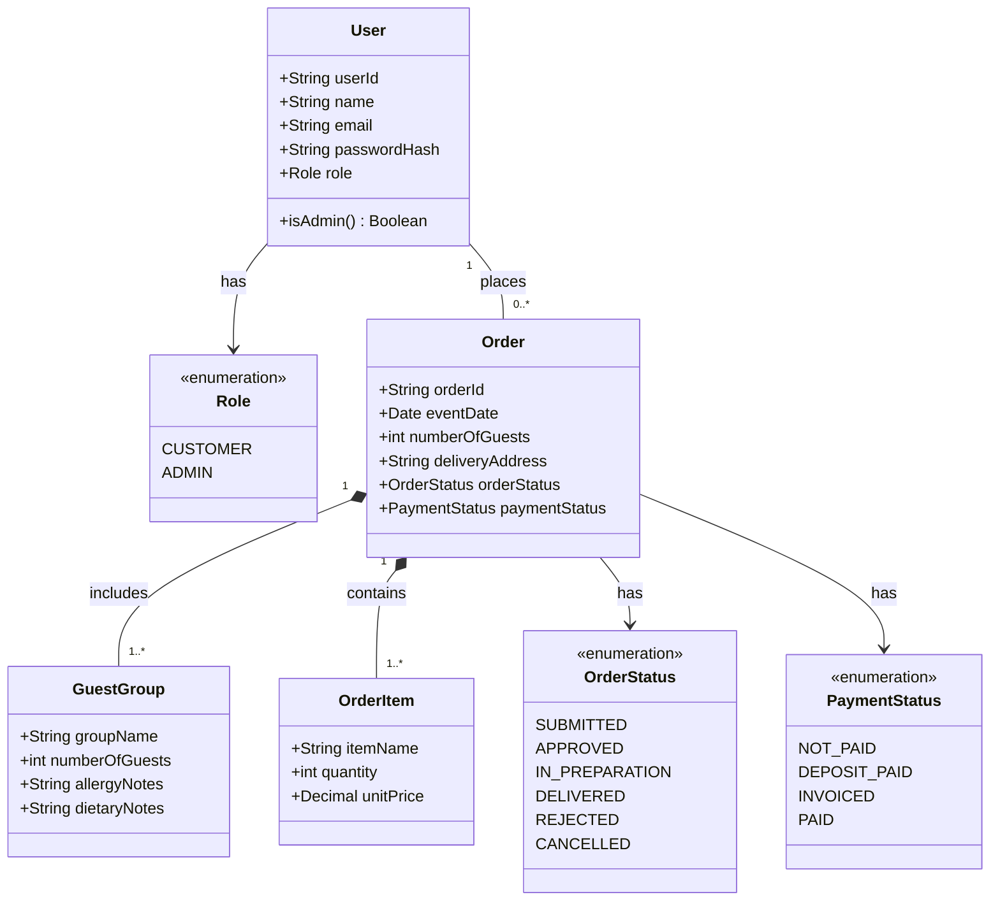

```mermaid
classDiagram
    direction TB

    class User {
        +String userId
        +String name
        +String email
        +String passwordHash
        +Role role
        +isAdmin() Boolean
    }

    class Role {
        <<enumeration>>
        CUSTOMER
        ADMIN
    }

    class OrderStatus {
            <<enumeration>>
            SUBMITTED
            APPROVED
            IN_PREPARATION
            DELIVERED
            REJECTED
            CANCELLED
        }
    
    class PaymentStatus {
            <<enumeration>>
            NOT_PAID
            DEPOSIT_PAID
            INVOICED
            PAID
        }

    class Order {
        +String orderId
        +Date eventDate
        +int numberOfGuests
        +String deliveryAddress
        +OrderStatus orderStatus
        +PaymentStatus paymentStatus
    }

    class GuestGroup {
        +String groupName
        +int numberOfGuests
        +String allergyNotes
        +String dietaryNotes
    }

    class OrderItem {
        +String itemName
        +int quantity
        +Decimal unitPrice
    }

    User --> Role : has
    User "1" -- "0..*" Order : places
    Order "1" *-- "1..*" GuestGroup : includes
    Order "1" *-- "1..*" OrderItem : contains
    Order --> OrderStatus : has
    Order --> PaymentStatus : has

```
