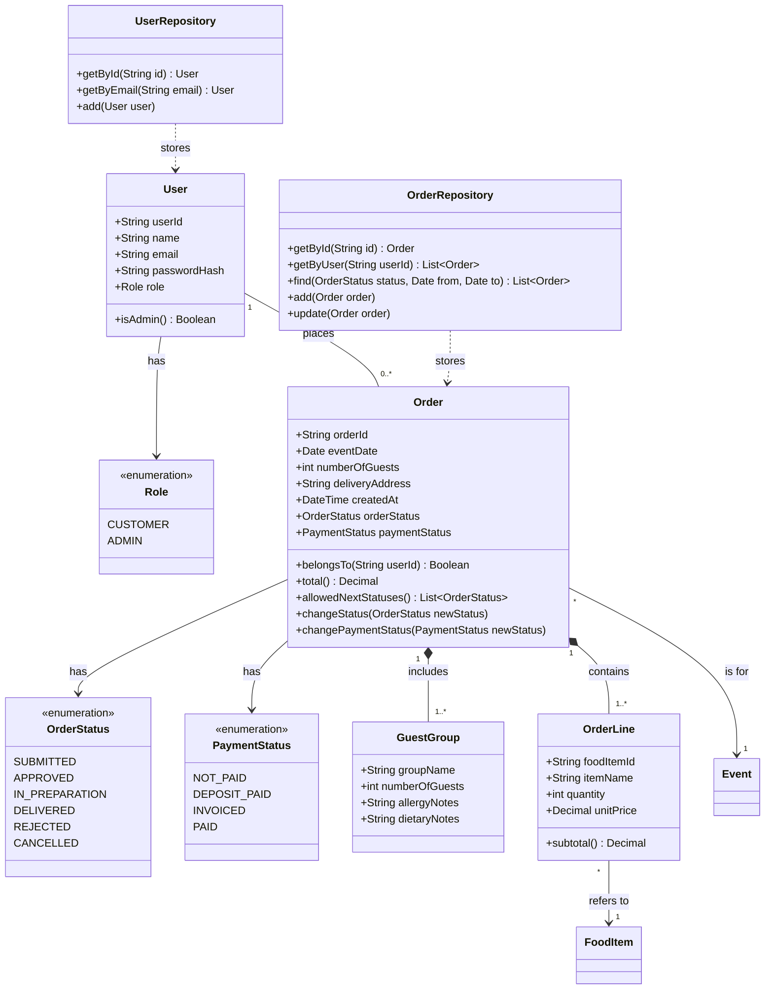

# Users and orders – class diagram

The domain classes for users (one `User` class with a `Role`), orders, guest groups, order lines and their repositories.

```mermaid
classDiagram
    direction TB

    class User {
        +String userId
        +String name
        +String email
        +String passwordHash
        +Role role
        +isAdmin() Boolean
    }

    class Role {
        <<enumeration>>
        CUSTOMER
        ADMIN
    }

    class OrderStatus {
        <<enumeration>>
        SUBMITTED
        APPROVED
        IN_PREPARATION
        DELIVERED
        REJECTED
        CANCELLED
    }

    class PaymentStatus {
        <<enumeration>>
        NOT_PAID
        DEPOSIT_PAID
        INVOICED
        PAID
    }

    class Order {
        +String orderId
        +Date eventDate
        +int numberOfGuests
        +String deliveryAddress
        +DateTime createdAt
        +OrderStatus orderStatus
        +PaymentStatus paymentStatus
        +belongsTo(String userId) Boolean
        +total() Decimal
        +allowedNextStatuses() List~OrderStatus~
        +changeStatus(OrderStatus newStatus)
        +changePaymentStatus(PaymentStatus newStatus)
    }

    class GuestGroup {
        +String groupName
        +int numberOfGuests
        +String allergyNotes
        +String dietaryNotes
    }

    class OrderLine {
        +String foodItemId
        +String itemName
        +int quantity
        +Decimal unitPrice
        +subtotal() Decimal
    }

    class UserRepository {
        +getById(String id) User
        +getByEmail(String email) User
        +add(User user)
    }

    class OrderRepository {
        +getById(String id) Order
        +getByUser(String userId) List~Order~
        +find(OrderStatus status, Date from, Date to) List~Order~
        +add(Order order)
        +update(Order order)
    }

    class FoodItem
    class Event

    User --> Role : has
    User "1" -- "0..*" Order : places
    Order "1" *-- "1..*" GuestGroup : includes
    Order "1" *-- "1..*" OrderLine : contains
    Order --> OrderStatus : has
    Order --> PaymentStatus : has
    Order "*" --> "1" Event : is for
    OrderLine "*" --> "1" FoodItem : refers to
    UserRepository ..> User : stores
    OrderRepository ..> Order : stores

```
