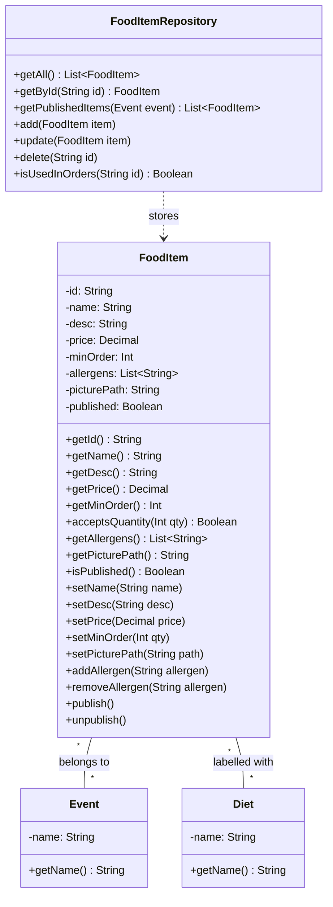

```mermaid
   classDiagram
    class FoodItem {
        -id: String
        -name: String
        -desc: String
        -price: Decimal
        -minOrder: Int
        -allergens: List~String~
        -picturePath: String
        -published: Boolean
        +getId() String
        +getName() String
        +getDesc() String
        +getPrice() Decimal
        +getMinOrder() Int
        +acceptsQuantity(Int qty) Boolean
        +getAllergens() List~String~
        +getPicturePath() String
        +isPublished() Boolean
        +setName(String name)
        +setDesc(String desc)
        +setPrice(Decimal price)
        +setMinOrder(Int qty)
        +setPicturePath(String path)
        +addAllergen(String allergen)
        +removeAllergen(String allergen)
        +publish()
        +unpublish()
    }

    class Event {
        -name: String
        +getName() String
    }

    class Diet {
        -name: String
        +getName() String
    }

    class FoodItemRepository {
        +getAll() List~FoodItem~
        +getById(String id) FoodItem
        +getPublishedItems(Event event) List~FoodItem~
        +add(FoodItem item)
        +update(FoodItem item)
        +delete(String id)
        +isUsedInOrders(String id) Boolean
    }

    FoodItem "*" -- "*" Event : belongs to
    FoodItem "*" -- "*" Diet : labelled with
    FoodItemRepository ..> FoodItem : stores

```
