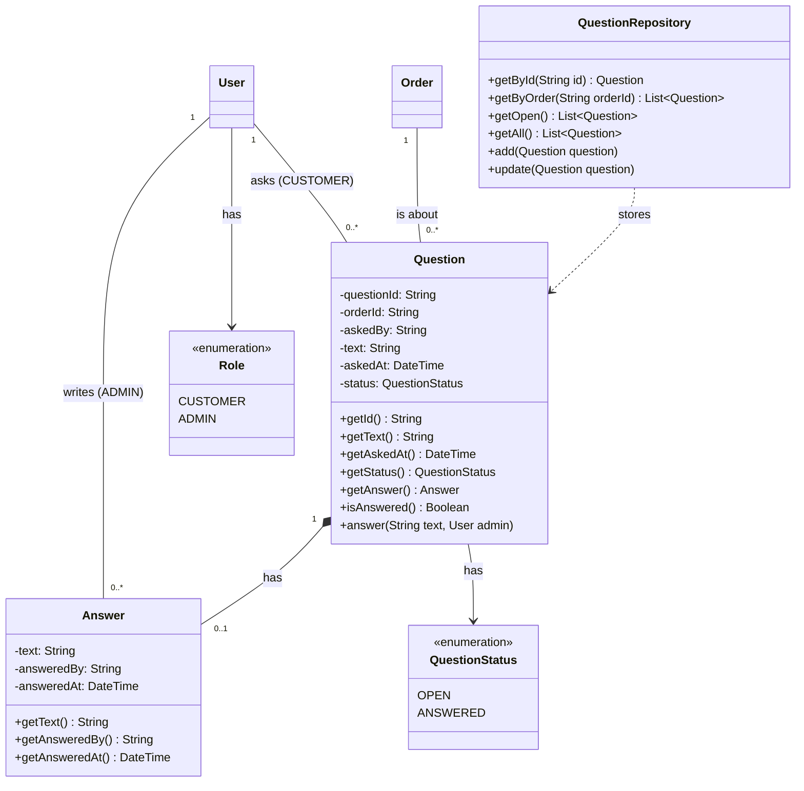

# A4 + C5 Questions – class diagram

```mermaid
classDiagram
    class Question {
        -questionId: String
        -orderId: String
        -askedBy: String
        -text: String
        -askedAt: DateTime
        -status: QuestionStatus
        +getId() String
        +getText() String
        +getAskedAt() DateTime
        +getStatus() QuestionStatus
        +getAnswer() Answer
        +isAnswered() Boolean
        +answer(String text, User admin)
    }

    class Answer {
        -text: String
        -answeredBy: String
        -answeredAt: DateTime
        +getText() String
        +getAnsweredBy() String
        +getAnsweredAt() DateTime
    }

    class QuestionStatus {
        <<enumeration>>
        OPEN
        ANSWERED
    }

    class QuestionRepository {
        +getById(String id) Question
        +getByOrder(String orderId) List~Question~
        +getOpen() List~Question~
        +getAll() List~Question~
        +add(Question question)
        +update(Question question)
    }

    class Order
    class User
    class Role {
        <<enumeration>>
        CUSTOMER
        ADMIN
    }

    User --> Role : has
    User "1" -- "0..*" Question : asks (CUSTOMER)
    User "1" -- "0..*" Answer : writes (ADMIN)
    Order "1" -- "0..*" Question : is about
    Question "1" *-- "0..1" Answer : has
    Question --> QuestionStatus : has
    QuestionRepository ..> Question : stores
```
