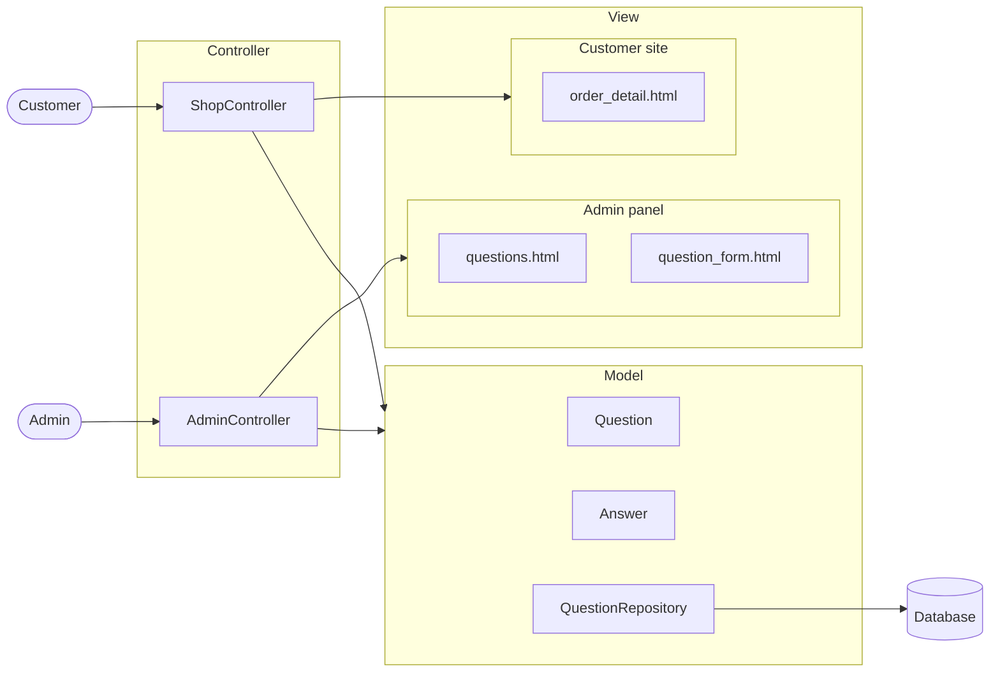

```mermaid
flowchart LR
    Customer([Customer]) --> ShopController
    Admin([Admin]) --> AdminController

    subgraph Controller [Controller]
        ShopController
        AdminController
    end

    subgraph View [View]
        subgraph CustomerViews [Customer site]
            order_detail.html
        end
        subgraph AdminViews [Admin panel]
            questions.html
            question_form.html
        end
    end

    subgraph Model [Model]
        Question
        Answer
        QuestionRepository
    end

    ShopController --> CustomerViews
    AdminController --> AdminViews
    ShopController --> Model
    AdminController --> Model
    QuestionRepository --> Storage[(Database)]
```